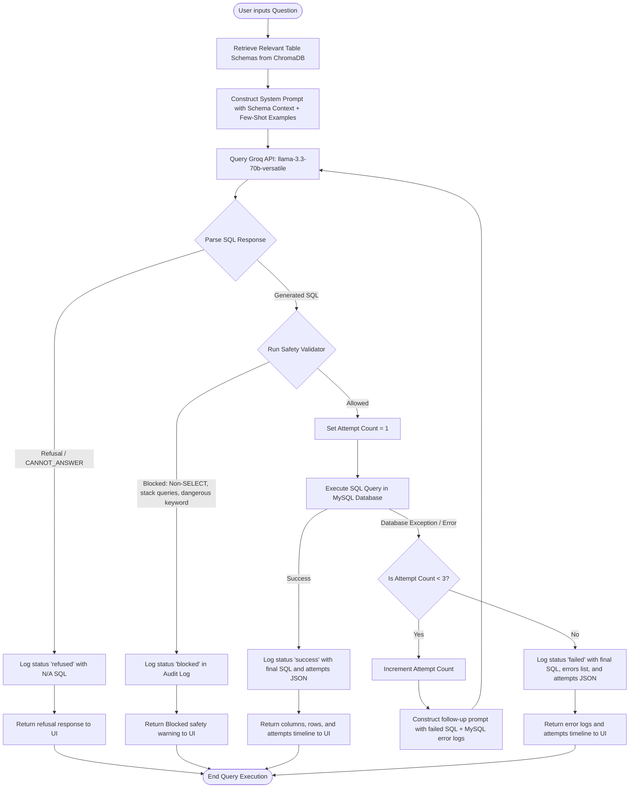
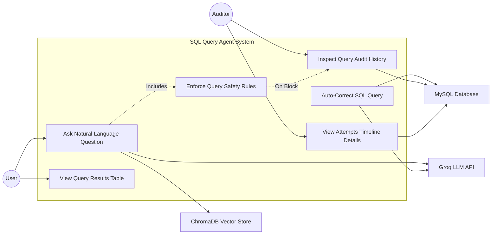

# SQL Query Agent - System Design Document

This document contains the visual design specs, including the **System Flow Chart** and the **Use Case Model** for the SQL Query Agent.

---

## 📊 1. System Flow Chart

The flow chart below illustrates the complete operational workflow of the query pipeline, safety validation rules, database query execution, self-correction retry mechanism (up to 3 times), and audit logging.

---

## 👥 2. Use Case Model

The Use Case Model identifies the actors (users and external systems interacting with the SQL Query Agent) and defines the system's boundary and functional use cases.

### Actors
1. **User (Actor)**: Plain-English business user asking questions and viewing query results.
2. **Administrator / Auditor (Actor)**: Oversees system operations, inspects governance logs, and audits AI actions.
3. **Groq LLM (System Actor)**: External LLM service used to generate and correct SQL code.
4. **ChromaDB Vector Store (System Actor)**: Manages semantic index search for schemas.
5. **MySQL Database (System Actor)**: Stores and executes queries against seeded transaction tables.

### Use Case Diagram (Mermaid)

---

## 📝 Use Case Descriptions

### Use Case 1: Ask Natural Language Question
* **Primary Actor**: User
* **System Actors**: ChromaDB Vector Store, Groq LLM API, MySQL Database
* **Pre-conditions**: The user is on the "Agent Chat" tab and the database is populated.
* **Basic Flow**:
  1. The user inputs an English question (e.g. "Average salary in Engineering").
  2. The system queries ChromaDB for relevant tables.
  3. The system queries the Groq API to compile the question into a SELECT query.
  4. The system validates the query for safety.
  5. The query executes against MySQL.
  6. The system displays the resulting data table.
* **Post-conditions**: The action is logged to the `query_audit_log` database table.

### Use Case 2: Auto-Correct SQL Query
* **Primary Actor**: None (System Internal Trigger)
* **System Actors**: Groq LLM API, MySQL Database
* **Pre-conditions**: A valid SQL query was generated but thrown a database execution error (e.g. syntax error or unknown column).
* **Basic Flow**:
  1. The system catches the MySQL error.
  2. The system appends the failed SQL and raw error message to the conversational history context.
  3. The system calls Groq LLM to generate a corrected query.
  4. The system repeats validation and retries execution.
* **Post-conditions**: Each attempt is documented in the audit log attempts timeline. The loop triggers up to 3 times total.

### Use Case 3: Enforce Query Safety Rules
* **Primary Actor**: None (System Internal Trigger)
* **Pre-conditions**: A SQL query has been successfully generated by the LLM.
* **Basic Flow**:
  1. The safety engine scans the SQL query.
  2. It checks if the statement starts with `SELECT` (ignoring comments).
  3. It validates that none of the blocked keywords (e.g. `DROP`, `DELETE`, `UPDATE`) are in the query.
  4. It checks that no semicolons divide multiple statements.
  5. If safe, the query is passed to MySQL. If unsafe, execution is immediately blocked.
* **Post-conditions**: Unsafe queries are intercepted and logged as `blocked` in the audit logs.

### Use Case 4: Inspect Query Audit History
* **Primary Actor**: Auditor / Administrator
* **System Actors**: MySQL Database
* **Pre-conditions**: Queries have been executed, and logs have been recorded in the database.
* **Basic Flow**:
  1. The auditor switches to the "Audit Log" tab.
  2. The frontend sends a request to `/api/audit-log`.
  3. The backend fetches query audit logs from MySQL.
  4. The frontend renders the high-level stats cards and the search-filtered governance table.
* **Post-conditions**: Shows metrics, status flags, and final SQL query parameters.
